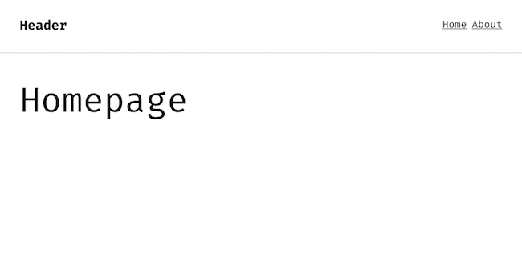

# Frontend Boilerplate

Frontend Clickdummy Boilerplate

Webpack build (ES6 / PostCSS) + Pug Templating

Includes Minimal CLI to generate repetetive code

```js
// Create new Route
// - pug template + view script
node cli g:route <name>
```


## Included Libraries

#### [jQuery.js](https://jquery.org)

```js
import $ from 'jquery';
```

#### [Barba.js](http://barbajs.org)

```javascript
import Barba, { BaseView, BaseTransition } from 'barba.js';
```

#### [GSAP](https://greensock.com)

```javascript
import { TweenMax, TimelineMax } from 'gsap';
```

#### [PostCSS](http://postcss.org/)

See ```postcss.config.js``` for plugin configuration

- **CSSNext**
- **AutoPrefixer**
- **Custom Media Queries**

```
--viewport-phone-small  : (max-width : 320px)
--viewport-phone        : (max-width : 400px)
--viewport-phone-wide   : (max-width : 480px)
--viewport-phablet      : (max-width : 560px)
--viewport-tablet-small : (max-width : 640px)
--viewport-tablet       : (max-width : 768px)
--viewport-tablet-wide  : (max-width : 1024px)
--viewport-desktop      : (max-width : 1250px)
--viewport-desktop-wide : (max-width : 1250px)
--viewport-desktop-huge : (min-width : 1920px)
```


## Screenshot




## Installing
**Clone Repo**
```
git clone git@github.com:dennissmuda/frontend-boilerplate
```
**Install Dependencies**
```
yarn install
```

## Developing
**Build JS/CSS**
```
yarn start
```
**Watch templates directory**
```
yarn templates
```

## Production Build
**Minify/Uglify**
```
yarn run prod
```
